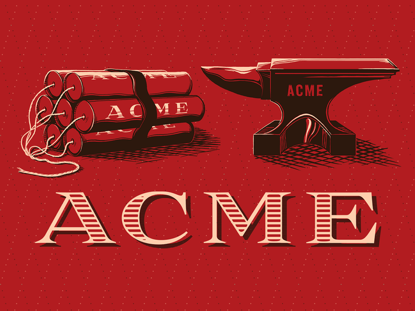
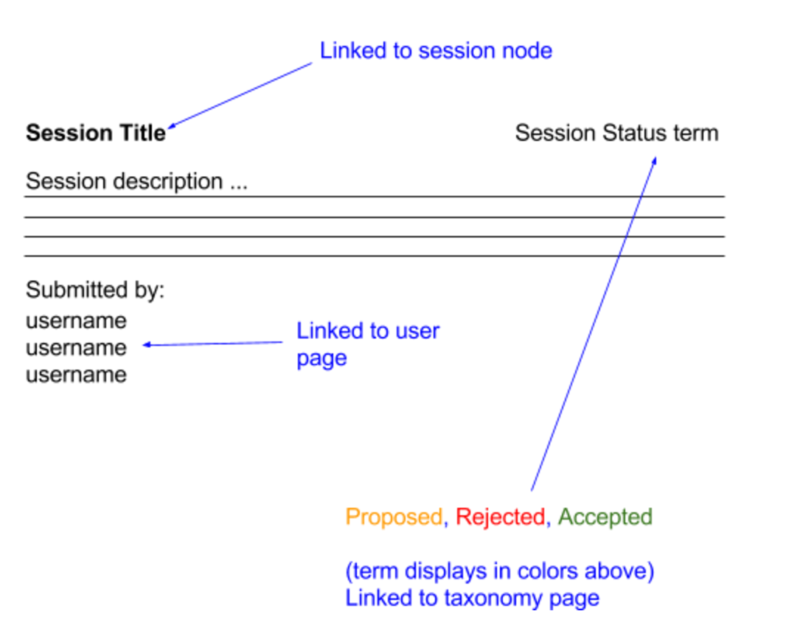

#  Part 1: ACME Camp Site

Your team has been contracted by ACME Corp to create a Drupal 8 based website for their upcoming user conference ACME Camp. The site will be used primarily to market the conference, provide newsletter signups, allow user registration, collect and display session submissions. 

## User Stories

### D8 Feature module exploration

Resources:
- [Features module page](https://www.drupal.org/project/features)
- [Handbook on Features for Drupal 8](https://www.drupal.org/node/2404427)
- [Announcing Features for Drupal 8](https://www.phase2technology.com/blog/announcing-features-for-drupal-8/)

#### Extend the user profile to support a *Speaker* profile. 
- **Featurize** your profile changes.
- A Speaker has:
  - Biography (textarea)

#### Create content type for *Session*
- **Featurize** your content type.
- A Session has:
  - Title (text, required)
  - Status (**taxonomy reference term** or a **list**, single value of: Submitted, Accepted, Rejected; required)
  - Description (rich text; optional)
  - Speaker (reference to User, multi-valued)

#### Allow user who have the **Speaker role** to be able to submit sessions
- **Beginner Mode:** Create the **Speaker** role and **featurize** this role
- **Intermediate Mode:**
  - Option A:  **Featurize** the create/edit/delete Session permissions for  the Speaker role
  - Option B; Use install hook to set the create/edit/delete Session permissions for the Speaker role
  - *(Hint: You will need the session content type feature as a dependency of this module)*

### Views and Queries
#### List of Session Submissions
Display Session Submissions and their session status, ordered by Title and allow filtering by status.
- **Beginner Mode:** Create this page using **Views**. Allow visitors to filter the view by status. **Featurize** this view.
- **Intermediate Mode:** Adjust the Twig template from the View

- **Advanced Mode:** Create this page using the [entityQuery](http://www.sitepoint.com/drupal-8-version-entityfieldquery/) service (D8’s version of D7 EFQ) and create a Twig template to display these list of sessions.
- :fire: **HACKS MODE:** :fire: Write a hard coded SQL Query 

### Form, Block, Services and Tests 
#### Newsletter Signup
- **Beginner Mode:** Create a **form** (that is its own page) that allows anonymous users to register for a newsletter by providing an e-mail address. *(Hint: Create a route and create your Form class)* On submit, display a message that says the form was submitted successfully. 
- **Intermediate Mode:** You’ve just created a page with a form on it. Now, let’s expand this to be be a signup form in a Block that can be placed on the homepage. *(Hint: Create a block and use the formBuilder object in your block)*
- Advanced Mode: 2 Options for next step (time permitting):
  - Option A: These submissions should be stored as entities on the Drupal site
  - Option B: These submissions are going to an external CRM. You don’t have to actually send any data on form submit outside of your test. Write a test to validate that your Service can send data to an external API endpoint using mock json objects. 
  - *(Hint: You will need to create a Service)*

#### List of User Tweets block *(3rd Party Integration)*
Display a block that will show a list of tweets that using #ACMECon hashtag
- Beginner Mode: Emded using an iframe in a custom **Block**. You can use a method like: https://twitframe.com/
- Intermediate Mode: Use the [Drupal Twitter Module](https://www.drupal.org/project/twitter) and deal with any problems that might arise from the module.
- Advanced Mode: Add a field Twitter handle (String) to the **Speaker** user profile and **update your feature**. Integrate with the [Twitter API](http://dev.twitter.com) to consume their json and create two twig templates: one for the Tweet and one for the list of tweets.
